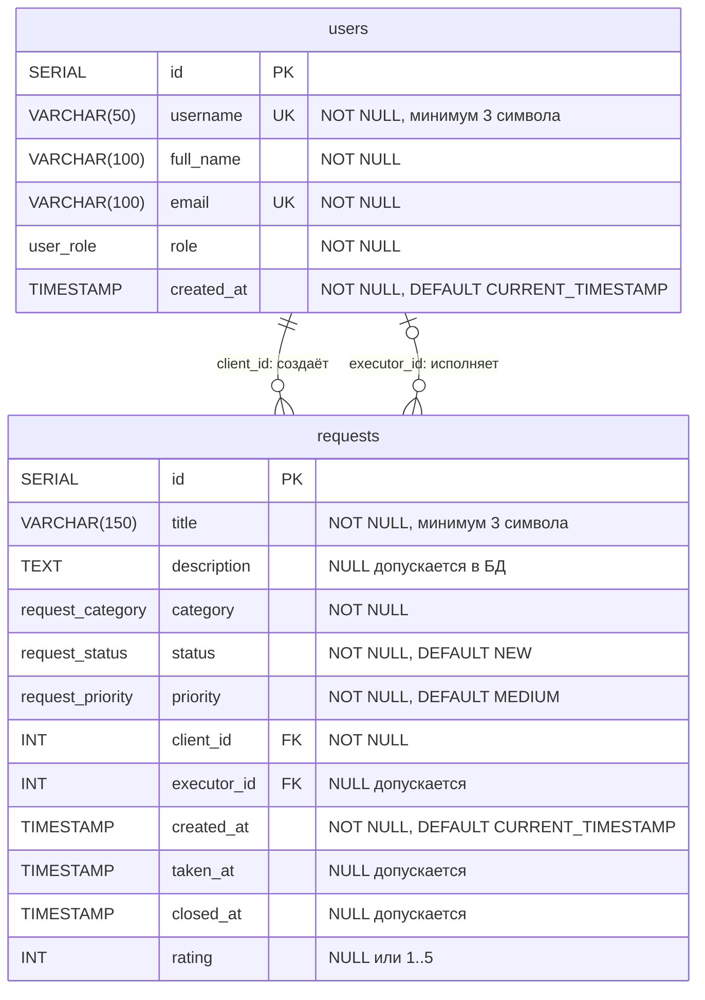

# ER-диаграмма

Диаграмма соответствует [sql/schema.sql](../sql/schema.sql). Mermaid отображается в GitHub и совместимых редакторах Markdown.

У каждой заявки ровно один клиент и ноль или один исполнитель. У пользователя может быть любое количество заявок в каждой из этих ролей. Роли CLIENT/EXECUTOR для соответствующих операций проверяет Java-сервис.

| Связь | При удалении пользователя | При изменении ID |
|---|---|---|
| `requests.client_id → users.id` | RESTRICT: клиент с заявками не удаляется | CASCADE |
| `requests.executor_id → users.id` | SET NULL: заявка остаётся без исполнителя | CASCADE |

| PostgreSQL ENUM | Значения |
|---|---|
| `user_role` | CLIENT, EXECUTOR, ADMIN |
| `request_category` | HARDWARE, SOFTWARE, NETWORK, CONSULTATION |
| `request_status` | NEW, IN_PROGRESS, WAITING, RESOLVED, CLOSED |
| `request_priority` | LOW, MEDIUM, HIGH |

Индексы заявок: `status`, `category`, `priority`, `client_id`, `executor_id`, `created_at`. Первичные и уникальные ключи также индексируются PostgreSQL.
